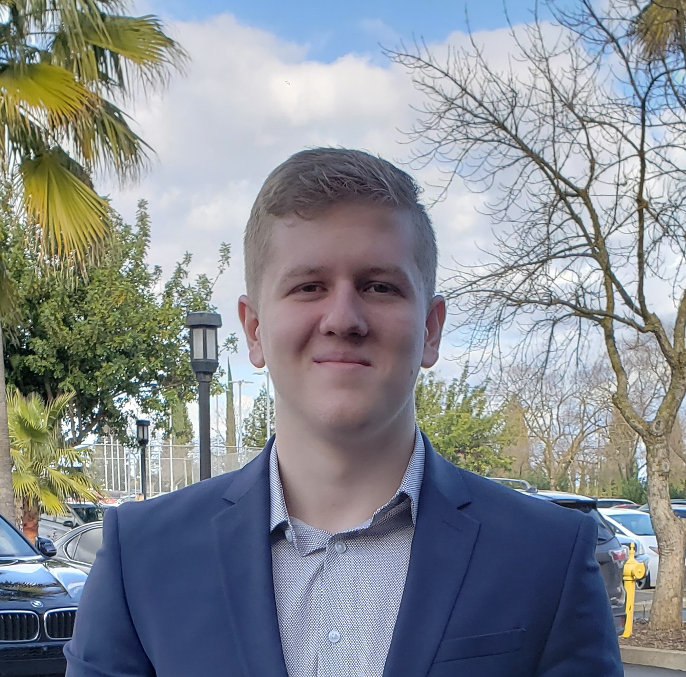

# Personal Statment

Software Engineer with over 5 years of experience in many different areas of software engineering. My current language of expertise is Python but I am also fluent in C and C++ and have some experience with goLang and Java. I also have some experience with database structuring specifically in OracleDB, and MySQL. I have taken a lot of courses on embedded programming and security training and also network training courses in addition to my professional experience. I am looking for a position with a company that values learning and encourages it as I want to expand my knowledge into many more fields like AI, Machine Learning, Cyber Security, and DevOps as of currently.